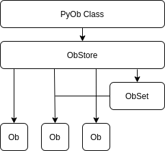

<h1 align="center">_PyOb</h1>

<p align="center">
    
</p>

PyOb is a high-level runtime object manager for Python 3 and above.

This project is under heavy development and not yet stable. It should not be used in a production environment.

More feature documentation as unit tests are completed...


## Installation

The Python Package Index (PyPI) can be used to install PyOb.

```
pip install pyob
```

## Basic Usage

Convert your Python classes into PyOb classes by simply inheriting from `pyob.Ob`:

```python
from pyob import Ob

class Country(Ob):
    """ A PyOb class to represent country objects """

    _str = "name"             # Optional PyOb attribute for a pretty str representation
    _keys = ("iso2", "iso3")  # Optional PyOb attribute defining unique key accessors

    def __init__(self, name: str, iso2: str, iso3: str):  # Optional type hints on attributes
        """ Init Method """

        self.name = name
        self.iso2 = iso2
        self.iso3 = iso3
```

Create object instances as you would any other Python class:

```python
khm = Country(name="Cambodia", iso2="KH", iso3="KHM")
jam = Country(name="Jamaica" , iso2="JM", iso3="JAM")
```

Notice that object instances are automatically tracked by an "object store" during runtime:

```python
Country.obs

# <CountryStore: 2 [<Country: Cambodia>, <Country: Jamaica>]>

Country.obs.count()

# 2
```

Retrieve objects from the object store by index as you would a list:

```python
Country.obs[0]

# <Country: Cambodia>

Country.obs[-1]

# <Country: Jamaica>
```

Retrieve objects from the object store by a unique key accessor like a dictionary:

```python
Country.obs >> "KH"   # ISO2

# <Country: Cambodia>

Country.obs >> "JAM"  # ISO3

# <Country: Jamaica>
```

Key accessors can also be applied as attributes given that they conform to valid dot syntax:

```python
Country.obs.JAM

# <Country: Jamaica>
```

Both of the above examples utilize the underlying `key` method which can also be used directly, particularly if you are unsure that the key and corresponding object instance exist:

```python
Country.obs.key("JAM")

# <Country: Jamaica>

Country.obs.key("XYZ")

# pyob.exceptions.NonExistentKeyError: A Country instance with a key of XYZ does not exist

Country.obs.key("XYZ", default=None)

# None
```

Note that key accessors are synonymous with a given instance and are therefore unique across key fields:

```python
jam.iso3 = "KHM"

# pyob.exceptions.DuplicateKeyError: A Country with a key of KHM already exists: Cambodia

jam.iso3 = "KH"

# pyob.exceptions.DuplicateKeyError: A Country with a key of KH already exists: Cambodia
```

And because key accessors are unique, they can be used as drop-in references to an object instance:

```python
khm in Country.obs

# True

"KH" in Country.obs

# True

"KHM" in Country.obs

# True
```

Sort object instances by one or multiple fields:

```python
Country.obs.sort("name")

# <CountrySet: 2 [<Country: Cambodia>, <Country: Jamaica>]>

Country.obs.sort("-name")

# <CountrySet: 2 [<Country: Jamaica>, <Country: Cambodia>]>

Country.obs.sort("name", "iso3")

# <CountrySet: 2 [<Country: Cambodia>, <Country: Jamaica>]>

Country.obs.sort("iso3", "name")

# <CountrySet: 2 [<Country: Jamaica>, <Country: Cambodia>]>
```

Filter object instances by one or multiple fields:

```python
Country.obs.filter(name="Cambodia", iso3="KHM")

# <CountrySet: 1 [<Country: Cambodia>]>

Country.obs.filter(name="Cambodia", iso3="JAM")

# <CountrySet: 0 []>
```

Note that the sort and filter operations both return "object sets," i.e. isolated subsets of the object store.

All operations intended to return more than one object instance produce object sets. Create your own like this:

```python
countries = Country.Set()

# <CountrySet: 0 []>

countries += khm

# <CountrySet: 1 [<Country: KHM>]>

countries += jam

# <CountrySet: 2 [<Country: KHM>, <Country: JAM>]>
```

You may notice that simply adding individual object instances will also result in an object set:

```python
khm + jam

# <CountrySet: 2 [<Country: KHM>, <Country: JAM>]>
```

The same is true of other object sets or iterables of object instances:

```python
countries = Country.Set() + khm

jam + countries

# <CountrySet: 2 [<Country: JAM>, <Country: KHM>]>

jam + [khm]

# <CountrySet: 2 [<Country: JAM>, <Country: KHM>]>
```

Type hints on instance attributes will be enforced at runtime by default:

```python
khm.iso2 = True

# pyob.exceptions.InvalidTypeError: Country.iso2 expects a value of type <class 'str'> but got: True (<class 'bool'>)

usa = Country(name="United States", iso2=35, iso3="USA")

# pyob.exceptions.InvalidTypeError: Country.iso2 expects a value of type <class 'str'> but got: 35 (<class 'int'>)
```

See PyOb's [feature guide](#feature-guide) for further explanation of these features plus many more.

## Feature Guide

<details>
<summary><strong>Objects</strong></summary>

<br/>

For demonstration purposes, we'll go ahead and create a PyOb class to represent country objects:

```python
# ┌─────────────────────────────────────────────────────────────────────────────────────
# │ PYOB IMPORTS
# └─────────────────────────────────────────────────────────────────────────────────────

from pyob import Ob

# ┌─────────────────────────────────────────────────────────────────────────────────────
# │ COUNTRY
# └─────────────────────────────────────────────────────────────────────────────────────

class Country(Ob):
    """ A PyOb class to represent country objects """

    # ┌─────────────────────────────────────────────────────────────────────────────────
    # │ PYOB ATTRIBUTES
    # └─────────────────────────────────────────────────────────────────────────────────

    # Set string field
    _str = "name"

    # ┌─────────────────────────────────────────────────────────────────────────────────
    # │ INIT METHOD
    # └─────────────────────────────────────────────────────────────────────────────────

    def __init__(
        self,
        name: str,
        iso2: str,
        iso3: str,
    ):
        """ Init Method """

        # ┌─────────────────────────────────────────────────────────────────────────────
        # │ INSTANCE ATTRIBUTES
        # └─────────────────────────────────────────────────────────────────────────────

        # Set country name
        self.name = name

        # Set ISO codes, e.g. US, USA
        self.iso2 = iso2
        self.iso3 = iso3
```

In this case, we assume that all `Country` objects should have a name, as well as an ISO2 and ISO3 alpha code.

We've also made use of our first PyOb attribute, `_str`, which informs PyOb that `Country.name` should be used when generating a `Country` instance's string representation so that it looks like this:

```
<Country: United States>
```

... instead of like this:

```
<Country: 0x7f1d2e5e4ac0>
```

Note that the type hints in the `Country` init method are optional but recommended if your wish to take advantage of PyOb's convenient [runtime type checking feature](#runtime-type-checking).

</details>

<details>
<summary><strong>Object Sets</strong></summary>

<br/>

An object set (`pyob.ObSet`) represents a collection of object instances.

Let's create two `Country` instances representing North and South Korea:

```python
prk = Country(name="North Korea", iso2="KP", iso3="PRK")
kor = Country(name="South Korea", iso2="KR", iso3="KOR")
```

We can combine these instances into an object set to represent the two Koreas:

```python
prk + kor

# <CountrySet: 2 [<Country: North Korea>, <Country: South Korea>]>
```

We could create the same object set in the following ways:

```python
Country.Set() + prk + kor
Country.Set() + [prk, kor]

# <CountrySet: 2 [<Country: North Korea>, <Country: South Korea>]>
```

As can be inferred in the above example, `Country.Set()` creates an empty `Country` object set to which `Country` instances, iterables, or other `Country` object sets can be added.

The behavior of object sets is list-like in that they can contain more than one reference to the same object:

```python
prk + kor + kor

# <CountrySet: 3 [<Country: North Korea>, <Country: South Korea>, <Country: South Korea>]>
```

</details>


<details>
<summary><strong>Object Stores</strong></summary>

<br/>

All PyOb classes are initialized with an object store (`pyob.ObStore`) that keeps track of object instances initialized during runtime. For those familiar with databases, objects are to rows as object stores are to tables.

We can verify that the `Country` object store contains no `Country` instances upon class definition:

```python
class Country(Ob):
    """ A PyOb class to represent country objects """
    # [ ... ]

Country.obs

# <CountryStore: 0 []>
```

Let's now create two country instances:

```python
tha = Country(name="Thailand",      iso2="TH", iso3="THA")
usa = Country(name="United States", iso2="US", iso3="USA")
```

Without doing anything further, we'll notice that our `CountryStore` now contains two `Country` instances:

```python
Country.obs

# <CountryStore: 2 [<Country: Thailand>, <Country: United States>]>
```

**Note:** Object stores are initialized at and persist throughout each runtime meaning that any file or script using the `Country` class will share a single object store regardless of where in your project the class is used.

Under most circumstances, this is not an issue (and may even be desired). However, to ensure that a given file or script uses an isolated object store, consider localizing your PyOb class:

```python
Country.obs

# <CountryStore: 2 [<Country: Thailand>, <Country: United States>]>

_Country = Country.Localized()
_Country.obs

# <CountryStore: 0 []>
```

</details>

<details>
<summary><strong>Object Class Labels</strong></summary>

<br/>

Documentation Pending Tests...

</details>

<details>
<summary><strong>List-like Index Slicing</strong></summary>

<br/>

Documentation Pending Tests...

</details>

<details>
<summary><strong>Dict-like Key Accessors</strong></summary>

<br/>

Documentation Pending Tests...

</details>

<details>
<summary><strong>Set-like Operation Logic</strong></summary>

<br/>

Documentation Pending Tests...

</details>

<details>
<summary><strong>ORM-like Sort Methods</strong></summary>

<br/>

Documentation Pending Tests...

</details>

<details>
<summary><strong>ORM-like Filter Methods</strong></summary>

<br/>

Documentation Pending Tests...

</details>

<details>
<summary><strong>ORM-like Descriptive Methods</strong></summary>

<br/>

Documentation Pending Tests...

</details>

<details>
<summary id="runtime-type-checking"><strong>Runtime Type Checking</strong></summary>

<br/>

Because our definition of `Country` includes type hints on its init method arguments, PyOb will automatically check their type before setting them as instance attributes, and raise an error if it encounters an incorrect type:

```python
chn = Country(name="China", iso2=35, iso3="CHN")

# pyob.exceptions.InvalidTypeError: Country.iso2 expects a value of type <class 'str'> but got: 35 (<class 'int'>)
```

Conveniently, runtime type checking is also performed when setting instance attributes on existing objects:

```python
usa.iso2 = True

# pyob.exceptions.InvalidTypeError: Country.iso2 expects a value of type <class 'str'> but got: True (<class 'bool'>)
```

In cases where the init method expects a type that will change before being set as an instance attribute, a class-level type hint will take precedence in the type check:

```python
# ┌─────────────────────────────────────────────────────────────────────────────────────
# │ MY OBJECT
# └─────────────────────────────────────────────────────────────────────────────────────

class MyObject(Ob):

    # ┌─────────────────────────────────────────────────────────────────────────────────
    # │ TYPE HINTS
    # └─────────────────────────────────────────────────────────────────────────────────

    number: int

    # ┌─────────────────────────────────────────────────────────────────────────────────
    # │ INIT METHOD
    # └─────────────────────────────────────────────────────────────────────────────────

    def __init__(self, number: str):
        """ Init Method """

        # Convert number to int
        number = int(number)

        # Set number
        self.number = number

# Create an object instance
my_object = MyObject(number="50")  # OK

# NOTE: The init method type hint can simply be omitted here if it isn't used for anything else
```

Note that PyOb utilizes the Python [typeguard](https://github.com/agronholm/typeguard) lubrary to perform these checks. Refer to the typeguard documentation for more information on type support and methodology.

Runtime type checking can be disabled with the following PyOb attribute:

```python
# ┌─────────────────────────────────────────────────────────────────────────────────────
# │ MY OBJECT
# └─────────────────────────────────────────────────────────────────────────────────────

class MyObject(Ob):

    # ┌─────────────────────────────────────────────────────────────────────────────────
    # │ PYOB ATTRIBUTES
    # └─────────────────────────────────────────────────────────────────────────────────

    # Disable type checking
    _disable_type_checking = True
```

</details>

## Attribute Reference

| Attribute              | Description                                                                           | Default | e.g.             |
|------------------------|---------------------------------------------------------------------------------------|---------|------------------|
| _str                   | The field used to generate a string representation of an object instance              | None    | "name"           |
| _label_singular        | The label used to represent an object class in singular form                          | None    | "Country"        |
| _label_plural          | The label used to represent an object class in plural form                            | None    | "Countries"      |
| _keys                  | The fields used as unique key accessors for instances in an object set or object store             | None    | ("iso2", "iso3") |
| _disable_type_checking | Whether to disable runtime type checking on instance attributes                       | False   | True             |

### More feature documentation as unit tests are completed...
